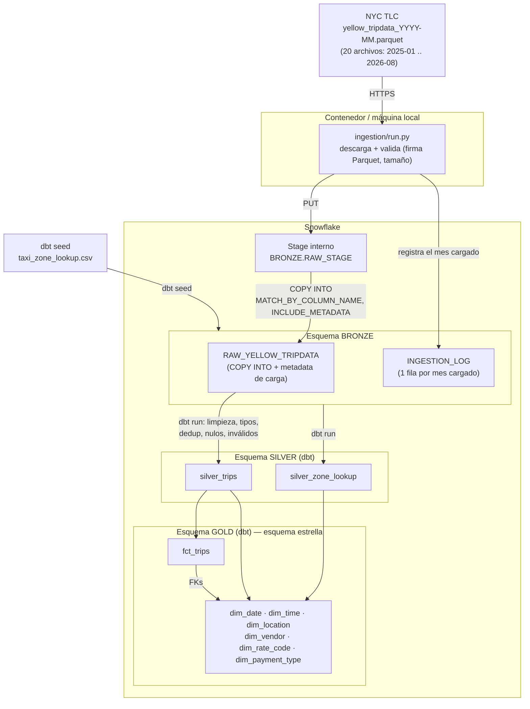

# Diagrama de arquitectura

**Infraestructura (`infra/setup_snowflake.py`)**: crea de forma idempotente el rol de
trabajo, el warehouse, la base de datos, los tres esquemas (BRONZE/SILVER/GOLD), el file
format Parquet, el stage interno y las tablas Bronze.

**Ingesta (`ingestion/run.py`)**: por cada uno de los 20 meses, descarga el parquet, lo
sube al stage y lo carga a `BRONZE.RAW_YELLOW_TRIPDATA` en una transacción (DELETE del mes +
COPY INTO + verificación de conteo + registro en `INGESTION_LOG`). Si algo falla, hace
`ROLLBACK`: nunca quedan cargas a medias ni filas duplicadas.

**Transformación (dbt, `dbt_taxi/`)**: `dbt build` corre, en orden de dependencias, el seed
(`taxi_zone_lookup`), los modelos Silver y los modelos Gold, y al final las pruebas
(`not_null`, `unique`, `relationships`). Todos los modelos Silver/Gold están materializados
como tablas, por lo que cada corrida los reconstruye por completo desde Bronze/Silver: correr
la tubería de nuevo nunca genera duplicados ni inconsistencias en estas capas.
