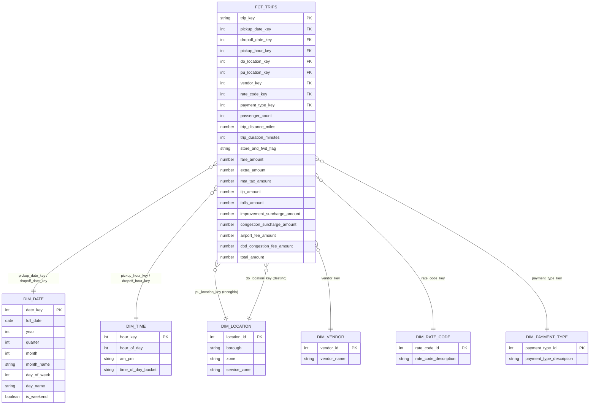

# Diagrama del esquema estrella (capa Gold)

**Grano de `fct_trips`**: un registro por viaje individual de yellow taxi.
`dim_location` cumple dos roles en el hecho (recogida y destino), por eso aparece dos veces
en el diagrama.

Detalle de columnas, tests (`not_null`, `unique`, `relationships`) y justificación de cada
transformación: `dbt_taxi/models/gold/_gold__models.yml` y los comentarios en cada `.sql`.
